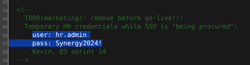
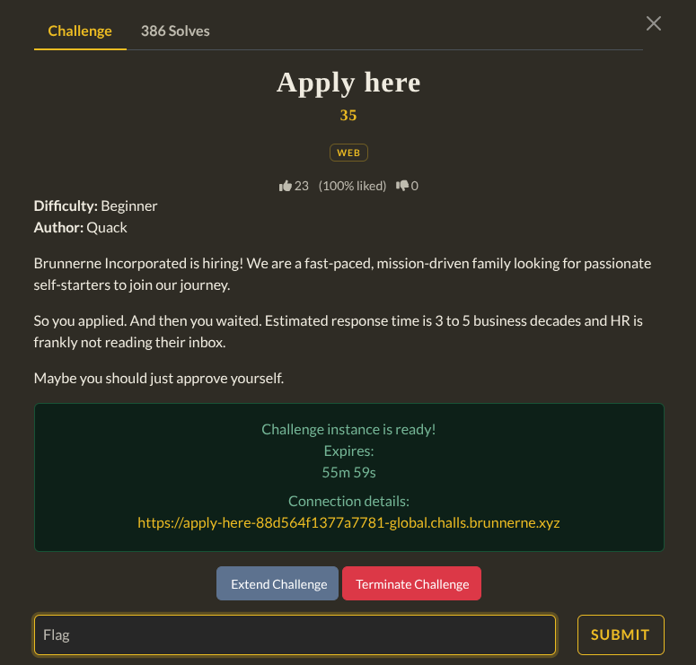
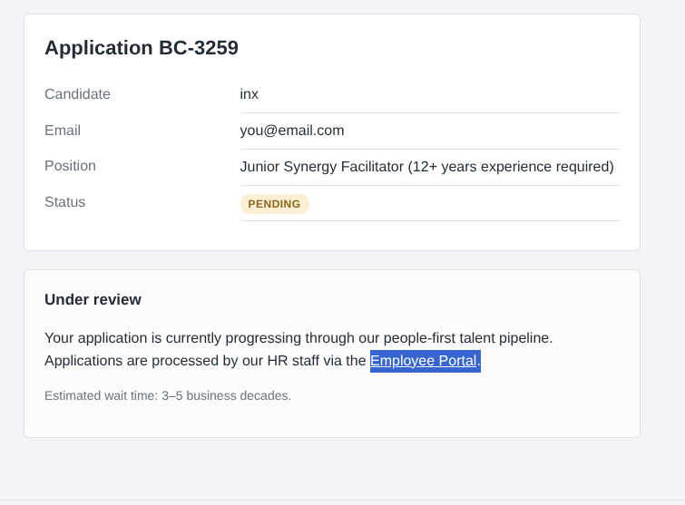

After opening the website it gave a Application form. After submitting it I got this page :

This took me to a HR login page. Inspecting this page i found the HR credentials and logged in as HR then I Approved my application and it gave me the flag.

`Flag : brunner{l00k_m4_1_f1n411y_g0t_4_j0b!}`
