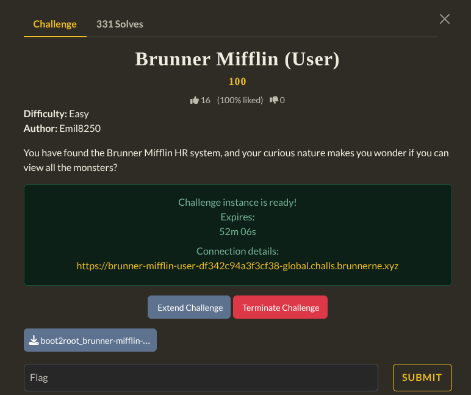
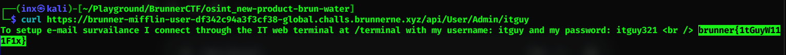

Visited the web and found a login page. But didnt found any credential so i logged in as guest. THen I saw IDOR in url which showed userId=5.
I then modified the userId until i got a user with role itguy.
Then I used curl to get the response of the request to api endpoint of that itguy.
There I got the flag.

`Flag : brunner{1tGuyW111F1x}`
