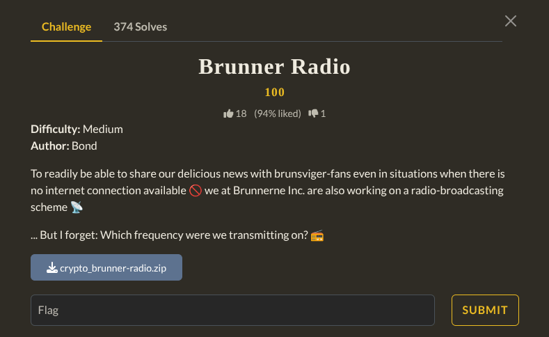
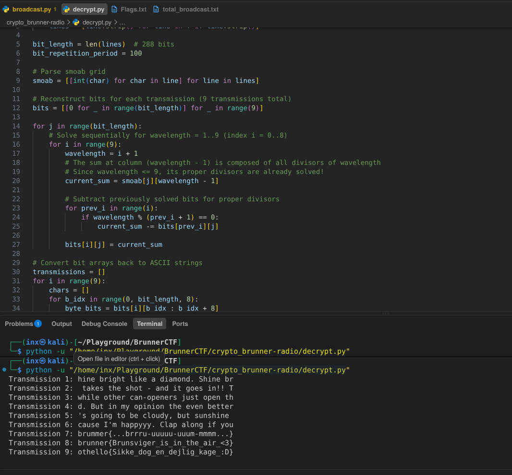

Downloaded the zipped folder then there was a file which was the process of encryption. Then i made a python decryption script. It gave the flag.


```
Flag : brunner{Brunsviger_is_in_the_air_<3}
```
