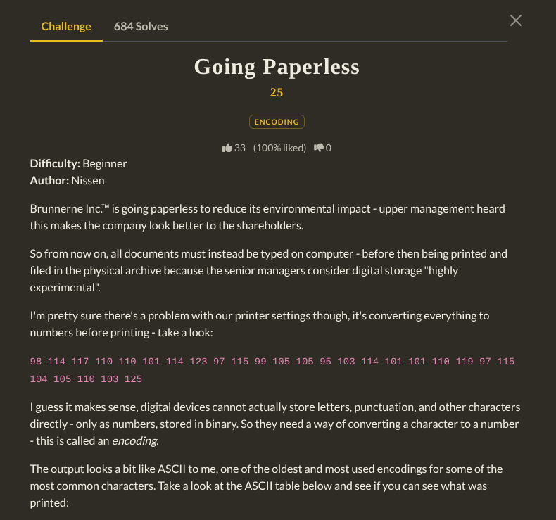
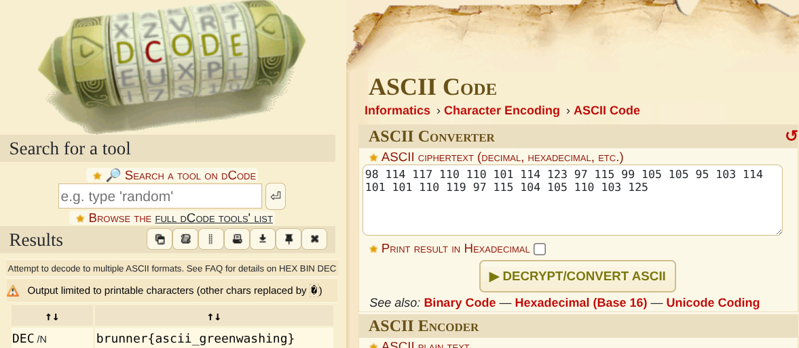

Copy the ASCII text given there and go to https://decode.fr/cipher-identifier
Then paste the text. Then decode it from ASCII text. Or you can also do it manually with the help of ASCII table available online.

`Flag : brunner{ascii_greenwashing}`
