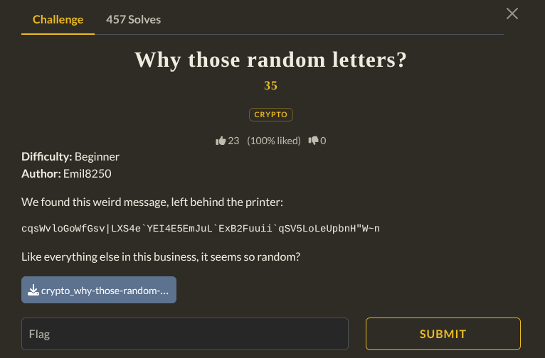

Downloading the file it gave me a encryption python file from that i made a decryption script. 
And it have the Flag.

![[Screenshot_20260822_172808.png]]

```Flag : brunner{W3_D34lt_w1th_R4ndom!}```
